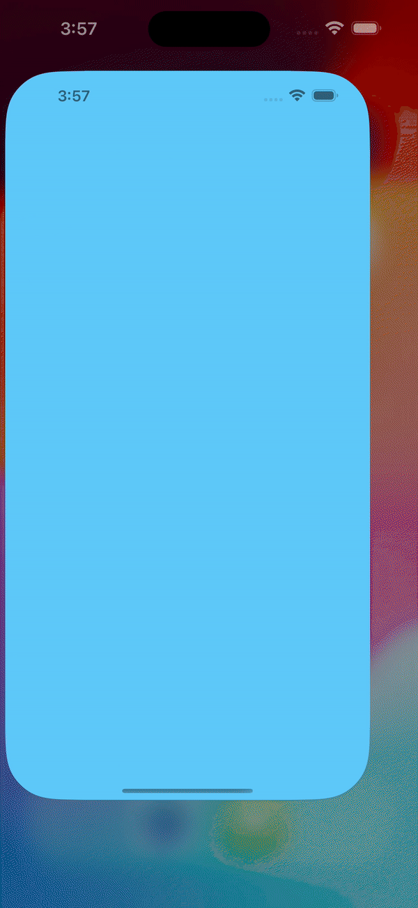
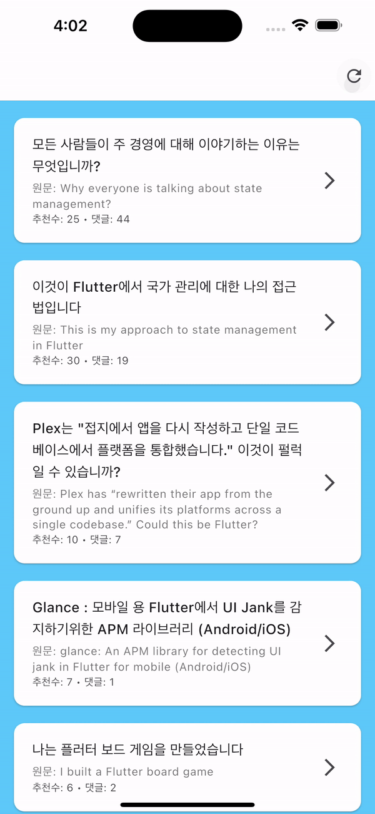

# 감자튀김딧

<div align="center">
  
</div>

<div align="center">
  A comfortable Korean translation app for reading Flutter posts from Reddit
</div>

## 소개
이 프로젝트는 [블루베리 팀](https://github.com/blueberry-team)과 함께합니다. 🫐

감자튀김딧(gamjatuigimdit)은 번역이 불가능한 Reddit 앱 대신 영어로 된 r/Flutter 서브레딧 글들을 한글로 번역해서 볼 수 있는 앱입니다.
영어에 능숙하지 않은 플러터 개발자들도 글로벌 플러터 커뮤니티의 유용한 정보들을 쉽게 접할 수 있도록 만들어졌습니다.

즉, 제가 영어를 잘하게 되는 날에 사라질 앱입니다.


## 아키텍처

프로젝트의 아키텍처는 [flutter-clean-architecture-riverpod](https://github.com/Uuttssaavv/flutter-clean-architecture-riverpod)를 참고하여 구성했습니다. 이를 통해 다음과 같은 이점을 얻을 수 있었습니다:

- 관심사 분리를 통한 코드 유지보수성 향상
- 테스트 용이성
- 의존성 규칙 준수
- 코드의 재사용성 증가

다만 클린 아키텍처가 소프트웨어의 전반적인 추상적 방법론이므로, 프로젝트의 규모와 특성을 고려하여 필요한 부분만을 선택적으로 적용하길 바랍니다.

## 프로젝트 구조
```
lib/
├── configs/           # 앱 설정
├── features/          # 주요 기능별 모듈
│   ├── post_list/    # 게시물 목록
│   │   ├── data/     # 데이터 계층 (repository 구현, 데이터 소스)
│   │   ├── domain/   # 도메인 계층 (entities, repository interface)
│   │   └── presentation/  # 프레젠테이션 계층 (화면, providers)
│   ├── post_detail/  # 게시물 상세
│   └── splash/       # 스플래시 화면
├── routes/           # 라우팅 설정
└── shared/          # 공통 컴포넌트 및 유틸리티
    ├── domain/      # 공통 도메인 모델
    └── exceptions/      # 에러 핸들링 코드
```

## 화면 미리보기

<div align="center">
  <table>
    <tr>
      <td align="center">
        
        <br>
        스플래시 화면
      </td>
      <td align="center">
        
        <br>
        게시물 목록
      </td>
      <td align="center">
        
        <br>
        게시물 상세
      </td>
    </tr>
  </table>
</div>
